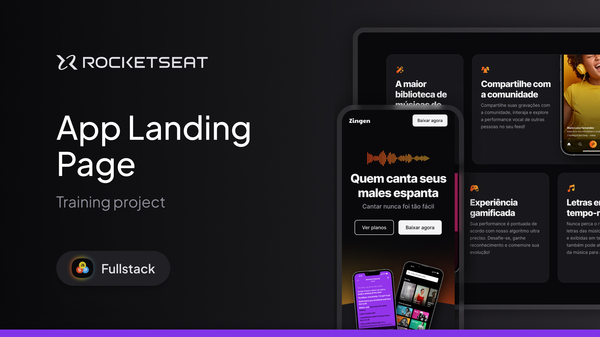

<h1 align="center"> Zingen Landing Page </h1>

Page developed during Fullstack postgraduate classes taught by Rocketseat

  <a href="#-technologies">Technologies</a>&nbsp;&nbsp;&nbsp;|&nbsp;&nbsp;&nbsp;
  <a href="#-project">Project</a>&nbsp;&nbsp;&nbsp;|&nbsp;&nbsp;&nbsp;
  <a href="#-layout">Layout</a>&nbsp;&nbsp;&nbsp;|&nbsp;&nbsp;&nbsp;
  <a href="#memo-license">License</a>

  

 

  

## 🚀 Technologies

This project was developed using the following technologies:

- HTML and CSS
- Git and Github
- Figma

## 💻 Project

Zengen is the simulation of a responsive landing page for a subscription music app.

## 🔖 Layout

You can view the project layout through [THIS LINK](https://www.figma.com/community/file/1371886246180677672). You must have an account on [Figma](https://figma.com) to access it.

## :memo: License

This project is under the MIT license.zen
